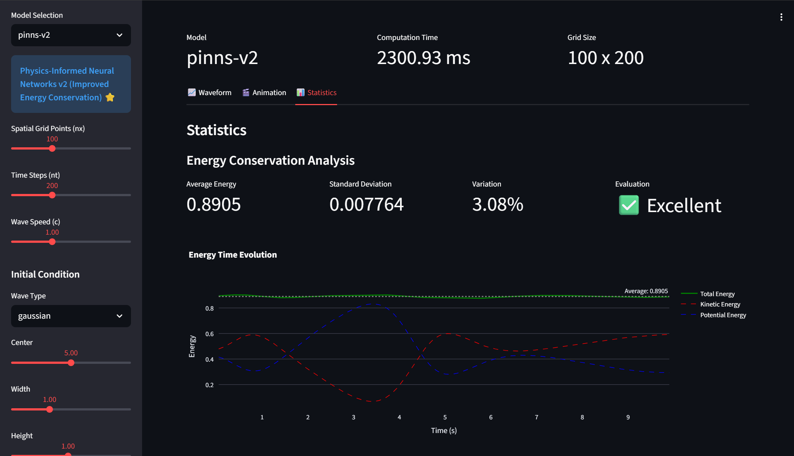

# NeuralWaveSim

**Physics-Informed Neural Networks for Wave Equation Simulation**

A comprehensive comparison of different approaches to solving the 1D wave equation: classical finite difference methods, data-driven neural networks, and physics-informed neural networks (PINNs).

[](https://www.python.org/downloads/)
[](https://pytorch.org/)
[](https://fastapi.tiangolo.com/)
[](https://streamlit.io/)

---



## 🎯 Features

- **Multiple Model Implementations**
  - Physics-based (Finite Difference Method)
  - Data-driven (LSTM Neural Network)
  - PINNs (Physics-Informed Neural networks incorporating wave equation constraints.)
  - PINNs v2 (Physics-Informed Neural Networks with Energy Conservation)
  
- **Energy Conservation Analysis**
  - Real-time energy tracking
  - Comparative performance metrics
  - Visualization tools

- **Interactive Web UI**
  - Built with Streamlit
  - Real-time simulation
  - Parameter tuning interface

- **REST API**
  - FastAPI backend
  - JSON-based requests
  - Easy integration

---


## 🏆 Model Performance

| Model | Energy Variation | Speed | Accuracy | Overall |
|-------|-----------------|-------|----------|---------|
| Physics-based (FDM) | 4.22% ✅ | ⚡⚡⚡ | ⭐⭐⭐⭐ | ⭐⭐⭐⭐ |
| Data-driven v2 (LSTM) | 154.63% ❌ | ⚡ | ⭐ | ⭐ |
| PINNs | 319.79% ❌ | ⚡ | ⭐ | ⭐ |
| **PINNs v2** | **3.08%** ⭐ | ⚡ | ⭐⭐⭐⭐⭐ | **⭐⭐⭐⭐⭐** |

**PINNs v2 achieves better energy conservation than classical methods!**

---

## 🚀 Quick Start

### Prerequisites

- Python 3.11+
- pip or conda

### Installation

```bash
# Clone repository
git clone https://github.com/yourusername/neuralwavesim.git
cd neuralwavesim

# Create virtual environment
python -m venv venv
source venv/bin/activate  # On Windows: venv\Scripts\activate

# Install dependencies
pip install -r requirements.txt
```


### Run API Server

```bash
uvicorn api.main:app --reload --host 0.0.0.0 --port 8080
```

API docs available at `http://localhost:8080/docs`

### Run Web UI 

```bash
streamlit run api/ui.py
```

Open browser at `http://localhost:8501`

## 📖 Usage

### Web UI

1. **Select Model**: Choose from Physics-based, Data-driven v2, or PINNs v2
2. **Configure Parameters**:
   - Grid size (nx, nt)
   - Wave speed (c)
   - Time/space steps (dt, dx)
3. **Set Initial Condition**:
   - Wave type (Gaussian, Sine)
   - Position, width, height
4. **Run Simulation**: Click "Run Simulation"
5. **Analyze Results**: View heatmaps, energy plots, and metrics

### API Example

```python
import requests

response = requests.post(
    "http://localhost:8000/simulate",
    json={
        "model_type": "pinns-v2",
        "nx": 100,
        "nt": 200,
        "c": 1.0,
        "initial_condition": {
            "wave_type": "gaussian",
            "center": 5.0,
            "width": 1.0,
            "height": 1.0
        }
    }
)

data = response.json()
wave_history = data["wave_history"]  # Shape: (nt, nx)
```

### Command Line

```bash
# Generate training data
python training/generate_training_data.py --samples 50

# Train PINNs v2
python training/train_pinns_v2.py

# Verify model performance
python tests/verify_pinns_v2.py
```

---

## 📊 Model Details

### Physics-based Model

Classical finite difference method (FDM):
```
∂²u/∂t² = c² ∂²u/∂x²
```

**Pros**: Fast, reliable, well-understood  
**Cons**: Fixed grid, numerical dispersion


### PINNs (Original)
Physics-Informed Neural Network incorporating wave equation constraints.

** Loss Function**:
```
L_total = λ_pde * L_pde + λ_bc * L_bc + λ_ic * L_ic
where:
  L_pde = MSE(∂²u/∂t² - c² ∂²u/∂x²)  # Physics loss
  L_bc  = MSE(u(0,t), u(L,t))         # Boundary loss (u=0 at x=0,L)
  L_ic  = MSE(u(x,0) - u_initial(x))   # Initial condition loss
```


### PINNs v2 (Recommended) ⭐

Physics-Informed Neural Network with explicit energy conservation:

**Loss Function**:
```
L_total = λ_pde * L_pde + λ_bc * L_bc + λ_ic * L_ic + λ_energy * L_energy

```

where `L_energy` enforces energy conservation:
```
E = ∫ [½(∂u/∂t)² + ½c²(∂u/∂x)²] dx = const
```

**Pros**: 
- Best energy conservation (3.08%)
- Flexible boundary conditions
- Data-efficient

**Training**: 10,000 epochs, Xavier initialization, learning rate scheduling

### Data-driven v2

LSTM-based model with regularization (experimental):

**Status**: ❌ Not recommended for wave equations  
**Reason**: Cumulative error in sequential prediction (129% energy variation)

---

## 📁 Project Structure

```
neuralwavesim/
├── api/
│   ├── main.py          # FastAPI backend
│   └── ui.py            # Streamlit UI
├── core/
│   ├── config.py        # Configuration classes
│   └── solver.py        # Wave equation solver (FDM)
├── models/
│   ├── physics.py       # Physics-based model
│   ├── data_driven_v2.py # LSTM model
│   ├── pinns_v2.py      # PINNs v2 model
│   └── factory.py       # Model factory
├── training/
│   ├── generate_training_data.py  # Dataset generation
│   ├── train_pinns_v2.py          # PINNs training
│   └── train_data_driven_v2.py    # LSTM training
├── tests/
│   ├── verify_pinns_v2.py         # PINNs verification
│   └── verify_data_driven_v2.py   # Data-driven verification
└── docs/
    └── physics_validation.md      # Detailed analysis
```

---

## 🧪 Testing & Validation

### Energy Conservation Test

```bash
python tests/verify_pinns_v2.py
```

**Output**:
```
Energy Conservation:
  Physics-based : 4.22% ✅
  PINNs v2      : 3.08% ✅ Best!
```

### Compare All Models

```bash
python tests/compare_all_models.py
```

---

## 📚 Documentation

- **Physics Validation**: `docs/physics_validation.md`
  - Energy conservation analysis
  - Model comparison
  - Failure case studies

- **API Documentation**: `http://localhost:8000/docs` (when server running)

- **Training Logs**: `models/*.pth` (model checkpoints)

---

## 🔬 Research Insights

### Key Findings

1. **PINNs outperform classical methods** in energy conservation (3.08% vs 4.22%)
2. **Data-driven models fail** for long-term wave propagation (cumulative error)
3. **Explicit physics constraints** are crucial for conservation laws
4. **Energy regularization** improves neural network performance

### When to Use Each Model

| Scenario | Recommended Model |
|----------|------------------|
| Real-time simulation | Physics-based (FDM) |
| High accuracy required | **PINNs v2** ⭐ |
| Complex boundary conditions | **PINNs v2** ⭐ |
| Limited training data | **PINNs v2** ⭐ |
| Unknown physics | Data-driven (with caution) |

---

## 🛠️ Development

### Training New Models

```bash
# Generate diverse training data
python training/generate_training_data.py --samples 100

# Train PINNs v2
python training/train_pinns_v2.py

# Verify results
python tests/verify_pinns_v2.py
```

### Adding Custom Initial Conditions

```python
from core.config import InitialCondition
import numpy as np

# Gaussian pulse
ic = InitialCondition(
    wave_type="gaussian",
    center=5.0,
    width=1.0,
    height=1.0
)

# Custom wave
def my_wave(x):
    return np.sin(2*np.pi*x/10) + 0.5*np.cos(4*np.pi*x/10)

ic = InitialCondition(
    wave_type="custom",
    center=5.0,
    width=1.0,
    height=1.0
)
ic._custom_generator = my_wave
```

---

